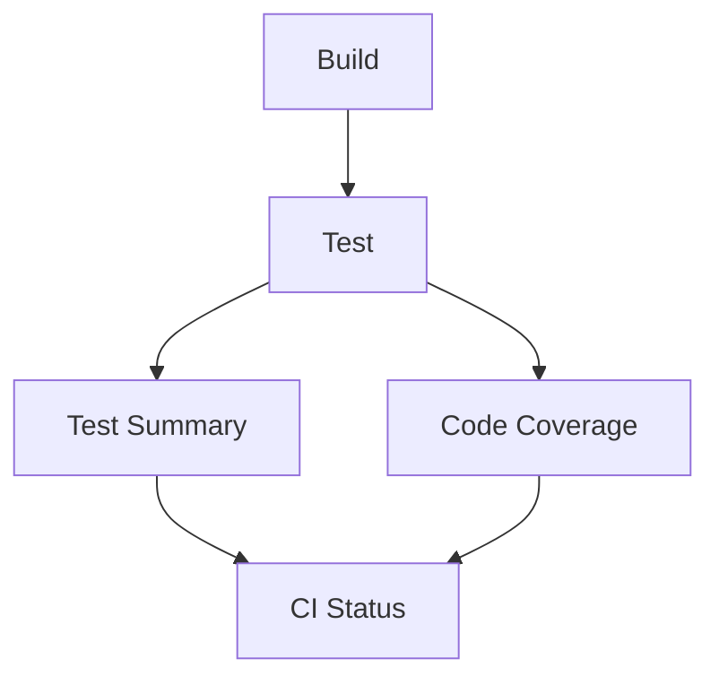

# GitHub Actions Workflows

This directory contains the CI/CD workflows for the SoulSync Dating App project.

## Workflow Structure

### 🚀 Primary Workflow

**`ci.yml`** - Main CI Pipeline
- **Triggers**: Push/PR to `main` or `develop` branches
- **Jobs**:
  1. **Build** - Compiles the solution with .NET 9
  2. **Test** - Runs all test projects in parallel (matrix strategy)
  3. **Test Summary** - Aggregates test results and creates summary
  4. **Code Coverage** - Generates coverage reports
  5. **CI Status** - Final status check and summary

### 📋 Standalone Workflows

**`build.yml`** - Standalone Build
- **Triggers**: Manual (`workflow_dispatch`)
- **Purpose**: Build-only workflow for testing build process independently

**`test.yml`** - Standalone Tests  
- **Triggers**: Manual (`workflow_dispatch`)
- **Purpose**: Test-only workflow for running tests independently

## Job Dependencies



## Features

✅ **Parallel Testing** - Test projects run in parallel using matrix strategy  
✅ **Smart Caching** - NuGet packages are cached for faster builds  
✅ **Comprehensive Reporting** - Test results, coverage reports, and summaries  
✅ **Artifact Management** - Build artifacts and test results are preserved  
✅ **Status Summaries** - Rich GitHub step summaries with status indicators  
✅ **Dependency Management** - Jobs run only when dependencies succeed  

## Test Coverage

The pipeline runs tests for:
- `SoulSync.Core.Tests` - Domain model tests (23 tests)
- `SoulSync.Agents.Tests` - AI agent functionality tests (17 tests)  
- `SoulSync.Services.Tests` - Service layer tests (21 tests)
- `SoulSync.Web.Tests` - Web component tests (1 test)

**Total: 62 tests across 4 projects**

## Configuration

- **Runtime**: .NET 9.0.x
- **OS**: Ubuntu Latest
- **Build Configuration**: Release
- **Test Logger**: TRX + Console (detailed)
- **Coverage**: XPlat Code Coverage

## Artifacts

- **Build Artifacts**: Solution binaries (1 day retention)
- **Test Results**: TRX files and coverage data with safe naming (7 days retention)
  - `test-results-tests-SoulSync.Core.Tests`
  - `test-results-tests-SoulSync.Agents.Tests`  
  - `test-results-tests-SoulSync.Services.Tests`
  - `test-results-tests-SoulSync.Web.Tests`
- **Coverage Reports**: HTML reports and JSON summaries (30 days retention)

## Usage

### Automatic Triggers
- Push to `main` or `develop` → Runs `ci.yml`
- Pull Request to `main` or `develop` → Runs `ci.yml`

### Manual Triggers
- Actions → `Build (Standalone)` → Run workflow
- Actions → `Tests (Standalone)` → Run workflow

## Status Badges

Add these to your main README.md:

```markdown


```